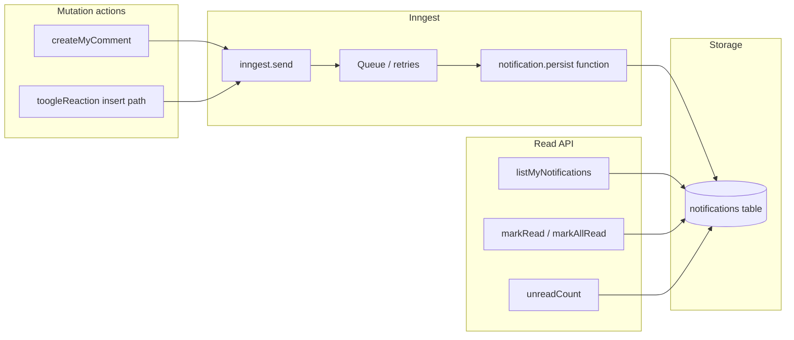

## Summary

Persisted in-app notification feed (dashboard today is a stub), with **Inngest** for queued delivery/retries. Events fire from comment and reaction server actions; a worker inserts into a new `notifications` table. List/read APIs + TanStack Query UI.

---

## Current state

- Comments: [`src/backend/services/comment.action.ts`](https://github.com/techdiary-dev/techdiary.dev/blob/main/src/backend/services/comment.action.ts) — `createMyComment` with `resource_type`: `ARTICLE` | `COMMENT` | `GIST`.
- Reactions: [`src/backend/services/reaction.actions.ts`](https://github.com/techdiary-dev/techdiary.dev/blob/main/src/backend/services/reaction.actions.ts) — `toogleReaction`; **notify only when a reaction is inserted** (not removed).
- Dashboard: [`src/app/dashboard/notifications/page.tsx`](https://github.com/techdiary-dev/techdiary.dev/blob/main/src/app/dashboard/notifications/page.tsx) is a stub. [`HomeLeftSidebar`](<https://github.com/techdiary-dev/techdiary.dev/blob/main/src/app/(home)/_components/HomeLeftSidebar.tsx>) already links to `/dashboard/notifications`.
- No `notifications` table yet. [`user_follows`](https://github.com/techdiary-dev/techdiary.dev/blob/main/src/backend/persistence/schemas.ts) exists in schema but no in-app follow UX (future event type).

## Target behavior (event matrix)

| Trigger                           | Recipient                | Notes                                       |
| --------------------------------- | ------------------------ | ------------------------------------------- |
| Comment on **article**            | Article `author_id`      | Skip if commenter is author.                |
| Reply on **comment**              | Parent comment `user_id` | Skip if replier is parent author.           |
| Comment on **gist**               | Gist `owner_id`          | After gist validation in `createMyComment`. |
| **Reaction added** on **article** | Article `author_id`      | Insert branch of `toogleReaction` only.     |
| **Reaction added** on **comment** | Comment `user_id`        | Insert only.                                |

**Out of initial scope:** reaction on gist (unless `GIST` is added to reaction types), bookmarks, new follower, email digests, mobile push.

**Product choice:** For replies, this plan assumes **notify parent comment author only** (not also article author). Confirm if you want both.

## Architecture (Inngest)

Mutations **send events** after the primary DB write. Inngest **functions** insert into `notifications` (retries + observability).

**Why Inngest:** lower latency for user requests, retries on failed inserts, room for email/digests/debouncing without bloating server actions.

## 1. Data model

Add `notifications` in [`schemas.ts`](https://github.com/techdiary-dev/techdiary.dev/blob/main/src/backend/persistence/schemas.ts); run Drizzle generate/push per project workflow.

Suggested columns:

- `id` (uuid, PK)
- `recipient_id` (uuid, FK → users, indexed)
- `actor_id` (uuid, FK → users, nullable)
- `type` (varchar): e.g. `COMMENT_ON_ARTICLE`, `REPLY_TO_COMMENT`, `COMMENT_ON_GIST`, `REACTION_ON_ARTICLE`, `REACTION_ON_COMMENT`
- `payload` (jsonb): deep-link fields only (`article_id`, `comment_id`, `gist_id`, `reaction_type`, handles for URLs, etc.)
- `read_at` (timestamp, nullable)
- `created_at` (timestamp)

Indexes: `(recipient_id, created_at DESC)`; partial `(recipient_id) WHERE read_at IS NULL` for unread counts.

Add types in [`domain-models.ts`](https://github.com/techdiary-dev/techdiary.dev/blob/main/src/backend/models/domain-models.ts); register SQLKit repo in [`persistence-repositories.ts`](https://github.com/techdiary-dev/techdiary.dev/blob/main/src/backend/persistence/persistence-repositories.ts) / contracts.

## 2. Inngest setup

- Add `inngest` package; App Router serve route (e.g. `src/app/api/inngest/route.ts`) per Inngest Next.js docs.
- Env: `INNGEST_EVENT_KEY`, `INNGEST_SIGNING_KEY`; extend [`src/env.ts`](https://github.com/techdiary-dev/techdiary.dev/blob/main/src/env.ts) for server-only vars.
- Typed event name (e.g. `app/notification.requested`) + shared **Zod** payload: `recipient_id`, `actor_id`, `type`, `payload`, optional `idempotencyKey`.

## 3. Inngest function: persist notification

`inngest.createFunction` handler:

- Skip if `recipient_id === actor_id`.
- Insert one `notifications` row.
- Optional idempotency (`idempotencyKey` or unique constraint) for retry safety.

All notification **writes** go through this path (or a helper only used here).

## 4. Emit from mutations (send events only)

After successful comment/reaction write, resolve recipient + build payload, then `inngest.send({ name: 'app/notification.requested', data: { ... } })`. **Do not** insert into `notifications` in the action.

**Comments** — after `comment.insert` in `createMyComment`:

- `ARTICLE` → article `author_id`
- `COMMENT` → parent comment `user_id`
- `GIST` → gist `owner_id`

**Reactions** — insert branch only:

- `ARTICLE` → article `author_id`
- `COMMENT` → comment `user_id`

**If `inngest.send` fails:** choose strict (fail mutation) vs log + continue (comment succeeds, no notification). Document the choice.

## 5. Read APIs (server actions)

[`notifications.actions.ts`](https://github.com/techdiary-dev/techdiary.dev/blob/main/src/backend/services/notifications.actions.ts) + Zod inputs:

- `listMyNotifications({ page, limit })` — join actor display fields
- `markNotificationRead` / `markAllNotificationsRead`
- `unreadNotificationCount` — badge

Use existing `ActionResponse` + `handleActionException`.

## 6. UI

- Replace notifications dashboard stub with TanStack Query list + mark-read mutations.
- Row: actor, copy by type, relative time, deep link to article/gist/comment.
- Optional: unread badge in Navbar/sidebar (polling or focus refetch).

## 7. i18n

Strings in [`bn.json`](https://github.com/techdiary-dev/techdiary.dev/blob/main/src/i18n/bn.json) + [`useTranslation`](https://github.com/techdiary-dev/techdiary.dev/blob/main/src/i18n/use-translation.ts) on client.

## 8. Phasing

| Phase   | Deliverable                                                                                              |
| ------- | -------------------------------------------------------------------------------------------------------- |
| **MVP** | Table + Inngest route + persist fn + send from comments/reactions + dashboard + mark read + unread count |
| **2**   | Infinite scroll; optional grouped reactions via Inngest debounce/aggregate                               |
| **3**   | Email steps or extra functions on same events                                                            |
| **4**   | “Live” UX: polling vs Inngest Realtime / other                                                           |

## 9. Testing

- Two accounts: comment → recipient sees notification after Inngest runs; reaction on comment → comment author notified; no self-notifications.
- Inngest dev: verify events + retries + idempotency.

---

## Implementation checklist

- [ ] Add `notifications` table + Drizzle migration; domain model + `persistenceRepository`
- [ ] Inngest package, `/api/inngest` route, env vars, event + Zod schema
- [ ] Inngest function: insert row (self-skip, optional idempotency)
- [ ] `createMyComment`: resolve recipient → `inngest.send`
- [ ] `toogleReaction` insert path: resolve recipient → `inngest.send`
- [ ] `notifications.actions`: list, markRead, markAllRead, unreadCount + inputs
- [ ] `/dashboard/notifications` UI + i18n
- [ ] (Optional) Navbar/sidebar unread badge
